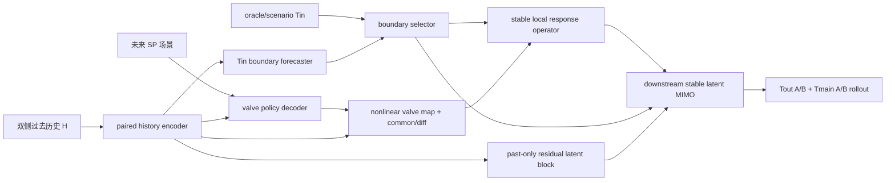

# Phase 3.5 MS3-R Gate C 模型架构设计

> 状态：本地设计放行；Linux 未授权；validation-only；不访问 test、不启动 MS4。

## 1. Gate C 要回答的问题

Gate A/B 已证明：A/B 阀位创新在 60/180 s 对各自 `Tin−Tout` 存在可分辨的短时条件响应；双输入日 Gram 条件数健康。它们也证明了三个限制：上游 Tin placebo 非零，SP 不能作为可信 IV，末温侧别归因失败。因此 Gate C 不再追求“两条独立的全白箱 plant”，而是验证一套可训练、可 rollout、可插入闭环的分层世界模型：短时局部阀位响应尽量显式，中长时共同蒸汽/金属/混合传播由稳定 latent MIMO 承接。

Gate C 的成功不是论文结论或任意反事实资格，而是同时满足：预测不显著退化、动作分支不坍缩、局部方向和时序与 Gate B 一致、未来边界无泄漏、长 rollout 稳定。

## 2. 三种架构选择

| 选择 | 优点 | 主要问题 | 决定 |
|---|---|---|---|
| 两侧完全分开的白箱 cascade | 解释直观 | Gate B 已否定末温硬侧别；缺少流量/压力/金属测点 | 拒绝 |
| 现有单侧 `free+response` 直接扩容 | 改动最小 | 不能锚定局部点位；free/response 分解仍不唯一 | 只作历史基线 |
| measured-boundary latent MIMO | 与 Gate B 证据对齐；允许公共/差分模态和末端交叉混合 | 模块更多，必须严控信息流和 selector | 采用 |

## 3. 高层架构

主状态表达为

\[
z_{k+1}=A_z(c_k)z_k+B_T(c_k)T^{in}_k+B_u(c_k)\phi(v_{A,k},v_{B,k})+G(c_k)\eta_k,
\]

\[
[\widehat T^{out}_A,\widehat T^{out}_B,\widehat T^{main}_A,\widehat T^{main}_B]_k=C(c_k)z_k.
\]

`B_u` 是稳定、方向受约束的局部响应槽；末温 decoder 允许完整 2×2 混合，不施加侧别对角硬约束。没有明确测点的混合、金属蓄热和未测流量合并为 stable latent block。

## 4. 双接口与禁止泄漏

同一 downstream 模型支持三种 Tin 来源：

1. `oracle_boundary`：真实未来 Tin，仅作为结构可解性上限，不能进入部署指标或冠军判决；
2. `forecast_boundary`：由过去历史和外生工况预测未来 Tin，是 observed-policy 预测主接口；
3. `scenario_boundary`：用户显式给定未来 Tin 场景，用于声明清楚的条件推演。

正式 rollout 的主表只能使用 `forecast_boundary`。必须同时报告 oracle−forecast gap，以区分 downstream 结构误差与上游边界误差。任何代码路径只要在 forecast/scenario 模式读取真实未来 Tin，立即协议失败。

动作主接口是未来 SP 场景，经 valve policy decoder 预测 A/B 阀位；logged future valve 只用于条件 plant 诊断和 oracle-action 上限。SP 不作为 IV，也不声称外生。

## 5. 模块语义

### 5.1 Paired history encoder

联合读取 A/B 历史和共享负荷、压力、给水、煤量、主汽流量，输出公共状态 `c_common` 与侧别状态 `c_A/c_B`。共享点位只存一份，避免重复特征被模型当成两次证据。

### 5.2 Valve policy decoder

输入过去状态和未来 SP，预测未来 A/B 阀位。它估计的是现场 cascade controller/actuator 的 observed-policy 映射，不是 plant。必须 causal-prefix：改变第 `k` 步后的 SP 不得改变此前阀位预测。

### 5.3 Boundary forecaster

只用过去历史、共享燃烧/负荷场景预测 Tin A/B。不得读取未来阀位或末温。其误差单独报告，不允许由 downstream 模块掩盖。

### 5.4 Local response operator

先将两阀非线性开度映射为

\[
u_c=(\phi_A(v_A)+\phi_B(v_B))/2,\quad
u_d=(\phi_A(v_A)-\phi_B(v_B))/2.
\]

响应槽必须满足 constant-action identity、有限稳定 rollout 和支持域内“开阀增加局部 `Tin−Tout`”的方向约束。允许 context scheduling 和非对角 MIMO；不把阀位映射称为喷水流量标定。

### 5.5 Residual/downstream latent block

残差分支只读过去状态及声明的外部未来边界，不读取 future logged valve。它承接未测扰动和慢传播，不得通过缩小容量被强迫解释局部喷水。下游 latent block允许 A/B 末温交叉混合。

## 6. 响应算子插槽

所有路线共用数据、encoder、boundary、valve policy、loss、selector 和预算，只替换 `local_response_operator`：

| Route | 作用 | 约束/边界 |
|---|---|---|
| `a1phys_three_pole` | 主候选；稳定三极点显式多步响应 | 不声称唯一物理阶次 |
| `stable_koopman_lpv` | 工况依赖双线性/LPV latent operator | 称 LPV representation，不称标准线性 Koopman |
| `pi_neural_ode` | 稳定 neural ODE closure | 只施加可验证的稳定/方向约束，不伪造焓平衡 |
| `deeponet_response` | 将未来边界/动作函数映射为局部响应函数 | 作为 operator-learning 对照；样本支持不足可淘汰 |

四路线不能通过各自专属 selector 获益；参数量、optimizer updates、数据 passes 和 trial 数同时报告。wall-clock只作安全上限。

## 7. 消融与批次结构

### RM0：本地结构合同

不训练真实数据。对所有模块验证 shape、finite、prefix causality、constant-action identity、符号、稳定状态、oracle/forecast 隔离和 serialization。

### RM1-A：分支归因筛查（单 seed、单 rolling fold）

固定 `a1phys_three_pole`，只比较六个候选：

| ID | residual capacity | local supervision | response scheduling | 目的 |
|---|---|---|---|---|
| `C0_paired_free` | base | 是 | 无 response | 动作负控 |
| `C1_additive_base` | base | 是 | additive | 简单加法基线 |
| `C2_sched_small` | small | 是 | scheduled | 容量下界 |
| `C3_sched_base` | base | 是 | scheduled | 主候选 |
| `C4_sched_large` | large | 是 | scheduled | free 吸收检查 |
| `C5_sched_base_terminal_only` | base | 否 | scheduled | 中间监督消融 |

若 small/base/large 的局部响应随 residual 容量单调消失而预测几乎不变，标记 decomposition non-identifiable，停止路线冠军判定。terminal-only 不得胜出后删除局部监督，只用于证明锚点必要性。

### RM1-B：响应算子筛查

继承 RM1-A 选中的 residual/local/scheduling 结构，对四个 operator route 各跑单 seed、同一 fold。结构门失败直接淘汰；不因单 seed MAE 小幅领先宣布冠军。

### RM2：正式 validation 比较

最多保留两条 operator route，与 `C0_paired_free`、`common_only` 和 `no_downstream_latent` 三个必要消融共同进入 3 seeds × 2 rolling folds。上限为 `5 candidates × 3 seeds × 2 folds = 30 runs`。若 RM1 只有一条路线合格，上限降为 24。具体远端矩阵在 RM0/RM1 本地代码验证后再冻结；当前数字是封闭上限，不是 Linux 授权。

## 8. 损失和 selector

训练采用最多总 updates 10% 的短 warm-up，随后全量 joint 解冻；不恢复长期 staged freeze。所有误差用 train-only robust scale 归一化：

\[
L=.15L_{valve}+.15L_{Tin}+.25L_{local}+.25L_{terminal}+.10L_{rollout}+.10L_{structure}.
\]

`L_structure` 包含 identity、局部方向、稳定性、response collapse 和 future-action leakage penalty。具体 floor、归一化分母和 near-zero 处理必须写入配置并由测试冻结。

Checkpoint 先过硬结构门，再在合格 checkpoint 中最小化 validation composite score。CFI、末温单一 MAE、test 和 Gate-B 诊断日都不得单独选 checkpoint。Gate-B 日只用于冻结方向/时序一致性审计，不作为训练标签重复拟合。

## 9. 放行门

RM1/RM2 至少同时满足：

- forecast-boundary 模式无未来真值泄漏，SP/valve prefix causality 精确；
- constant-action identity 和 finite/stable rollout 过门；
- 60/180 s 局部正确路径对错侧、lead 仍保持正的逐日配对下界；
- response 不坍缩，且 free capacity 扫描不显示任意分解；
- terminal prediction 不以牺牲 local/Tin/valve 为代价；
- oracle−forecast gap、common/differential 支持域和 opening/closing 分层完整报告；
- 统计单位为 UTC 日/连续时间块，seed 只表示优化稳定性。

失败时保留 observed-policy prediction 基线，不通过缩阈值、删 placebo 或打开 test 补救。

## 10. ADR：为什么采用 measured-boundary latent MIMO

**状态：Accepted for local implementation.**

**背景：** Gate B 支持短时局部双输入响应，但末温侧别和 SP-IV 不支持。

**决定：** 使用显式局部 MIMO response slot + 无硬侧别的稳定 downstream latent block；Tin 使用 oracle/forecast/scenario 三接口；SP 为部署动作接口，valve 为内部 controller state 与诊断接口。

**后果：** 模型可在证据支持处保留物理约束，并在无测点处合并 latent 状态；代价是训练目标与审计更复杂。它仍是 disturbance-conditioned closed-loop world model，不是完全 plant identification。
