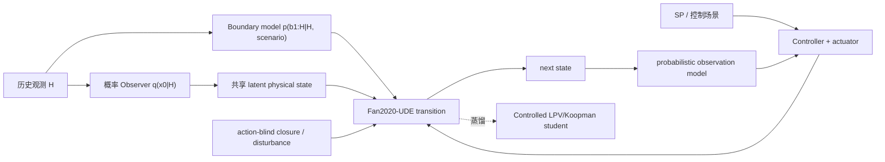

# 概率物理状态世界模型最终 Pipeline 设计

> 状态：架构基线 v0.1。本文冻结职责、信息权限和证据拼接方式；尚未授权 Linux 长训，也不预设最终动力学冠军。

## 1. 论文和模型对象

最终对象不是“Fan2020 加一个神经残差”，也不是把 PINN、Koopman、DeepONet 并列赛马，而是一个在闭环工业数据下统一四类能力的生成式状态空间模型：

1. 从历史观测概率初始化不可测状态；
2. 在不读取真实未来边界的条件下做概率预测；
3. 通过显式动作通道完成支持域内有限反事实；
4. 与真实控制器接口逐步交互，完成闭环 rollout。

建议论文定位：**An identifiability-aware probabilistic physics-state world model for closed-loop industrial thermal processes**。

## 2. 最终计算图

数学合同为：

\[
q_\phi(x_k\mid H_k)=\mathcal N(\mu_\phi(H_k),\Sigma_\phi(H_k)),
\]

\[
b_{k:k+H}\sim p_\psi(b\mid H_k,\xi),
\]

\[
x_{t+1}=\Phi_{\Delta t}\!\left(F_{\mathrm{Fan20}}(x_t,b_t,\varphi(u_t);\eta(c_t))+S r_\theta(x_t,b_t,\epsilon_t)\right),
\]

\[
y_t\sim p_\omega(y_t\mid x_t).
\]

这里 `r_theta` 不读取未来动作、SP、阀位预测或它们的未来后代；动作只能通过 `varphi(u)` 和显式物理通道进入 transition。自然预测、动作替换和闭环仿真必须共用同一 transition，禁止为反事实另造一个 response head。

## 3. 模块职责和最小接口

| 模块 | 输入 | 输出 | 硬边界 |
|---|---|---|---|
| Observer | 过去测点、过去动作、过去工况 | 初态后验 `mu, Sigma` | 不读未来；必须通过相邻窗口 state-continuity 检查 |
| Boundary | 历史与声明场景 | Tin/负荷/压力等未来分布 | forecast 模式不得使用真实未来边界；oracle 只能单独报告 |
| Controller/actuator | SP、预测测点、内部控制状态 | 阀位/有效动作 | SP、控制器输出、实际阀位分层；含饱和、死区和速率边界 |
| Fan2020-UDE | 当前状态、边界、动作 | 下一物理/latent 状态 | 守恒位置固定；阀位映射单调；稳定参数有界 |
| Closure | 当前状态、当前/过去边界、噪声 | 允许位置的状态修正 | action-blind；不得重复向多个能量位置无依据注热 |
| Observation | 当前状态 | 多测点分布 | 同时锚定 Tin、局部温降、末温和可用辅助测点 |
| Koopman student | 母模型状态/轨迹、边界、动作 | 快速 lifted rollout | 只在母模型通过门禁后训练；不升级因果证据 |

未可靠测量的喷水流量、金属壁温、混合细节不继续拆成多个伪监督模块；它们进入受稳定性、守恒位置和观测接口约束的 latent block。

## 4. 训练 Pipeline

采用“短预训练后联合校准”，不采用长期 freeze 串联训练：

1. **S0 数据与权限冻结**：统一 paired A/B、gap-aware windows、rolling folds、oracle/forecast 输入标签和 action-support mask。
2. **S1 Observer/Boundary 预训练**：只训练短期重构、未来边界分布和相邻窗口状态连续；不产生物理响应结论。
3. **S2 物理母模型校准**：用 observed boundary/oracle action 分离 transition 误差，比较固定 Fan20、工况参数适配、蒸发状态和 action-blind closure。
4. **S3 端到端联合训练**：全部主要模块解冻，以小学习率联合优化多步 ELBO/likelihood、Tin/local/terminal、多窗口 continuation、能量与响应约束。
5. **S4 双模式一致性**：同一初态同时执行 oracle-boundary 和 forecast-boundary rollout，定位误差来自 observer/boundary 还是 plant transition。
6. **S5 快速代理**：从冻结母模型和真实支持域轨迹蒸馏 controlled LPV/Koopman；A1 为局部透明回退。

selector 不能只看 terminal MAE。至少联合考虑 forecast NLL/MAE、state continuation、local/terminal rollout、constant-action identity、correct/wrong/lead placebo、响应稳定性和数值稳定性。闭环指标只作后置门禁，不反向参与无约束调参。

## 5. 第一轮候选，不做方法堆叠

| ID | 候选 | 回答的问题 |
|---|---|---|
| P0 | 高容量概率黑箱 | 预测上限；是否缺乏动作响应 |
| P1 | 固定 Fan2020 transition + learned observer | 仅解决初态后，物理骨架能走多远 |
| P2 | P1 + 工况参数适配/单调阀位映射 | 真实数据适配是否主要是参数问题 |
| P3 | P2 + 蒸发/干燥 latent state | 两相结构是否提供可重复增益 |
| P4 | P3 + action-blind closure | 在不污染动作通道时能否补足自然预测 |
| P5 | P4 的 controlled Koopman student | 能否获得实时速度且保持母模型响应 |

经典 PINN 只作为“软方程残差 vs 硬嵌入 transition”的消融；DeepONet 暂不进入首轮，因为当前首先需要闭合可延续状态和闭环逐步交互，而不是固定 H60 的函数到函数映射。

## 6. 用已有内容先拼出的证据

| Pipeline 命题 | 已有证据来源 | 现状 |
|---|---|---|
| 纯物理先验不够 | Ad hoc 初始漂移、湿/干分层、蒸发修复 | 已支持“需要闭合项”，未支持最终结构 |
| 纯预测器不等于 simulator | Direct WM 对象阶跃接近零、Phase/RM3 动作响应审计 | 已支持 |
| free/residual 会抢或改写响应 | RM3-AV 与 ad hoc residual feedback/replay | 已支持为真实风险，不等于所有 residual 都失败 |
| 中间测点不可省 | Gate C/RM2、蒸发局部温度修复 | 已支持 |
| 长串点预测会累计误差 | Gate C local 改善不传递到 terminal、downstream latent 消融 | 部分支持，需 joint-state 直接对照 |
| 物理母模型可以降阶 | 六工况精确局部线性化 | 仅母模型内部支持 |
| 闭环历史不能识别任意动作 | Gate A/B 输入秩、placebo、弱 IV | 已支持边界声明 |

权威详细映射见 [Fan2020-UDE 证据链](../../physical_models/fan2020_ude/evidence/EVIDENCE_CHAIN.md)。

## 7. 只补决定性缺口的实验

首轮不做全模型长训，先执行六个 2-fold × 1-seed 判别实验：

1. **O1 初态可延续性**：learned posterior vs steady/zero/oracle initialization；检查相邻窗口状态和 H60/H180 rollout。
2. **B1 边界权限**：oracle Tin/valve、forecast Tin/valve、无未来边界三模式，量化误差传播。
3. **T1 transition 递进消融**：P1→P4，每次只加一个物理或闭合组件。
4. **R1 residual 权限×容量**：small/base/large action-blind closure，监测 MAE、动作 Jacobian、物理能量和响应幅值。
5. **J1 serial chain vs joint state**：完全相同参数预算和输入权限，验证共享状态是否减少串行误差累计。
6. **K1 母模型→Koopman 蒸馏**：比较速度、H60/H180 轨迹、局部阶跃和 controller-in-loop 等价性。

只有 O1/B1/T1/R1 形成同向证据，才进入多 seed/full-data。K1 不影响母模型选择，也不允许用加速结果掩盖母模型物理失败。

## 8. 最终声明边界

在没有现场外生小激励、可信工具变量或独立仿真真值前，最终论文最多声明：

> a disturbance-conditioned, support-aware probabilistic physics-state world model that unifies forecasting, conditional action response and controller-in-the-loop rollout.

不能声明完全 plant identification、恢复真实喷水质量流量、任意策略 `do(valve)` 或现场闭环性能提升。合成真值只证明方法可解性；真实数据的预测、placebo、响应不变性和闭环稳定必须分别给证据。
