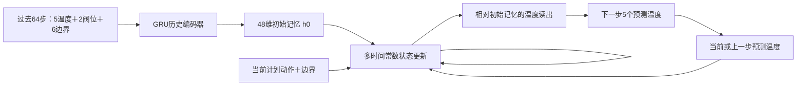

# 全部基线 1/3 数据较充分训练：回传解读

回传提交：`c696bf9`。训练代码：`cf1499c`。本次分析不训练、不重新选择 checkpoint，不改变下一轮实验范围。

## 结论先说

全部9个训练家族都达到了预先规定的验证停滞条件，另含persistence和anchored_hold，共21行评价，无失败。此前6轮快筛明显低估了GRU、attention和R4。当前没有一个模型同时拿下短期精度、长程精度和可靠动作响应，不能据此收敛到SSM单一路线。

- 主汽温H32：SSM 0.5725°C，GRU 0.5770°C，差距仅0.0045°C；单seed不支持稳定胜负结论。
- 主汽温block H128：R4-MLP 1.1305°C最好；block H512：R4 1.6374°C最好。
- 全五温度平均：Direct短期1.1497°C最好；SSM分块长程3.0511°C最好。只看末端温度会遗漏这个区别。
- 连续响应：R4/R4-MLP保留设定的方向和路径约束，但幅度随训练下降；分块重编码会破坏部分约束。
- AIT短期显著改善，native H512却达到39.6461°C，说明短期拟合和长程递推能力可以分离。这里只能评价本仓库的轻量实现，不是对CEDAR论文的否定。

## 本轮训练够不够

同一20,371个训练起点，128个selector窗口，256个报告窗口；训练目标都是H32，没有只给某个家族更长监督。全部从头训练，seed11。最终学习率都降至0.0001，停止原因为validation_plateau。

| 家族 | 总轮数 | short最优轮 | balanced最优轮 |
|---|---:|---:|---:|
| Direct-no-action | 38 | 16 | 12 |
| Direct | 35 | 13 | 12 |
| GRU | 49 | 48 | 25 |
| SSM | 47 | 46 | 25 |
| Attention-concat | 58 | 52 | 25 |
| AIT | 43 | 36 | 29 |
| R4 | 38 | 20 | 20 |
| R4-MLP | 38 | 35 | 20 |
| R4-DirectRef | 33 | 25 | 19 |

这回答了“六轮太短”的问题，但不等于证明达到最优解。停止规则允许小于0.002°C的细微改善；例如GRU/SSM的short最优仍接近末轮。后续如果需要判断千分位的优势，应比较多seed稳定性，而非把本次小差距解释为架构必然优势。九次拟合耗时合计约117.7分钟，不包含全部评价开销。

## 全部11个基线的精度

下面统一用**short选模**：各模型都按selector的H32主汽温MAE选checkpoint，没有逐指标挑报告集最好的权重。balanced完整表也保留在[原始完整表](../../results/action_predictor_bench_20260919/full33_seed11/ALL_BASELINES.md)。

步长10秒：H32=5分20秒、H128=21分20秒、H512=85分20秒。MAE是前H步平均绝对误差，不是第H步单点误差。

| 模型 | 主汽温H32 | block H128 | block H512 | native H512 |
|---|---:|---:|---:|---:|
| Persistence | 1.0750 | 1.5879 | 2.0520 | 2.0520 |
| Direct-no-action | 0.6309 | 1.2750 | 1.8523 | — |
| Direct | 0.6148 | 1.2293 | 1.8211 | — |
| GRU | 0.5770 | 1.2067 | 1.7715 | 3.1595 |
| SSM | 0.5725 | 1.1675 | 1.6945 | 1.8778 |
| Attention-concat | 0.5880 | 1.1720 | 1.8377 | 4.8998 |
| AIT | 0.5906 | 1.2349 | 2.2756 | 39.6461 |
| R4 | 0.5999 | 1.1493 | 1.6374 | 1.7879 |
| R4-MLP | 0.5984 | 1.1305 | 1.6662 | 1.8156 |
| R4-DirectRef | 0.6363 | 1.2712 | 1.8616 | — |
| Anchored-hold | 0.6676 | 1.3036 | 1.8565 | 1.8210* |

block：每32步将预测的五个温度与相应动作/边界拼回历史，再重新编码，不注入真实未来温度。native：只编码起点，连续递推512步；它测试的是超过32步训练长度的时间外推，不代表新工况泛化。Direct只有固定32步输出头，不支持native；*Anchored-hold的native是Direct背景分块＋R4响应连续的混合协议。

这些是给定记录边界输入下的条件预测，尚不是边界也由模型自行生成的闭环整厂模拟。

balanced选模采用selector上0.5×H32＋0.5×block H128，但在报告集上并未普遍更好。例如SSM的block H512从short的1.6945变为balanced的1.8692；GRU从1.7715变为1.9456。说明当前selector的长程排序未稳定迁移到报告段，不能把“综合选模”当成必然改善；也不能逐项挑两者更好的数拼出一个不存在的模型。

## 与六轮快筛相比，认识改变在哪里

同为1/3数据，H32：GRU从0.6899降到0.5770，Attention-concat从0.7680降到0.5880，AIT从0.7621降到0.5906，R4从0.7265降到0.5999。SSM从0.6438降到0.5725。足量训练让多条路线重新有竞争力。

但训练更久不保证外推更好：SSM的block H512从1.6029变为1.6945，AIT的native H512从26.9983变为39.6461。这里同时改变了训练预算、学习率调度和选中轮次，不把差异归因于单一机制。

R4相对SSM的主汽温H32多0.0274°C，block H512少0.0571°C；这个权衡值得研究。它不满足“所有精度都不损失”，但也不是用大幅牺牲精度换结构约束。

## 动作响应：学到了什么，缺什么

每种支持的协议有110个动作方案，包含±1/3/6个百分点、单阀/双阀、阶跃/脉冲/斜坡/正弦/平滑动作/双脉冲，以及窗口前、早中晚和跨块边界。每方案从8个起点中排除阀位越界的起点，不同方案有效样本数可能不同。

下表仍用short权重。“方向不符”是按方案等权平均的**可达温度通道**逆向比例，并非只算主汽温，也不等于实测干预误差。参照假设是固定其他边界时开阀产生冷却；复杂真实工况可能需要更细的条件假设。

| 模型/协议 | 方向不符均值 | +3pp阀1，末端主汽温变化 | +3pp阀2，末端主汽温变化 |
|---|---:|---:|---:|
| Direct/block | 39.89% | +0.0503 | -0.2664 |
| GRU/native | 46.19% | -0.3061 | -0.6373 |
| SSM/native | 43.79% | -0.0158 | -0.2936 |
| Attention-concat/native | 55.14% | +0.1290 | -0.2293 |
| AIT/native | 43.37% | -0.4252 | -2.3274 |
| R4/native | 0.00% | -0.0552 | -0.0730 |
| R4-MLP/native | 0.00% | -0.0428 | -0.0721 |
| R4/block | 8.64% | -0.0102 | -0.1513 |
| R4-MLP/block | 8.83% | +0.0129 | -0.1661 |

末端变化指从评分窗口开始加阶跃后，128步末端相对原计划的预测差值。单位°C。前后段均有完整统计，见[按动作形状和位置分组的补表](../../results/action_predictor_bench_20260919/full33_seed11/SUPPLEMENT.md)。

**第一，黑箱模型确实读到了动作，但尚未学到稳定可用的动作机制。** SSM单个阀1阶跃末端略降温，不代表全过程/所有通道/所有工况方向正确。其native方向不符均值43.79%，且假定不可达上游通道最大变化4.2211°C。足量事实训练没有自动消除这个问题。

**第二，R4响应非零、方向和路径约束有效，但幅度可能被拟合目标压低。** 同一+3pp测试，六轮R4的两个末端响应为-0.0861/-0.0907°C，本轮为-0.0552/-0.0730°C；绝对幅度下降约36%/19%。R4-MLP下降约57%/32%。这是本轮权重与旧权重的观察，尚未证明是单一损失机制导致；更不能以“方向零违规”判定响应已经学准。

**第三，连续状态与分块重编码的区别很大。** R4/native上游响应为零，block最大达到2.1112°C；R4-MLP的阀1末端响应甚至从native负值变成block正值。重新编码把候选预测和历史动作写回背景，是优先隔离的路径。保持连续动作状态、保持候选无关背景，比再加一个方向损失更直接。

**第四，动作发生的时间必须检查。** Direct把未来32步输入一次性送入输出头，没有动作因果遮罩，晚动作可能改变更早的预测。所有方案中动作发生前全通道最大变化3.5401°C，晚期onset=112组也有0.7338°C。GRU/SSM/AIT等逐步递推在这些测试中该项为零。Direct-no-action虽然当前块不读未来动作，后续块的历史仍会读到已写入的候选动作，所以长程响应不为零；名字不意味着全程动作中性。

**第五，晚动作的小响应未必是失败。** R4/native的onset=112组平均绝对响应只有0.00014°C，留给动作传播的时间短。需要给各起效时刻相同的“动作后观察长度”，才能区分物理延迟和响应消失；正弦/正负交替动作更适合检查幅值、相位和恢复，不能套固定冷却符号。

## 把当前SSM当成一个小模拟器来理解

可以把它想成48个“记忆容器”，有的变化快，有的变化慢。它们不是直接可测的48个物理量，而是训练出来的隐变量。

1. 看过去64步（10分40秒），用一个GRU压缩成48个数，作为系统当前记忆。
2. 每预测一步，把旧记忆、上一时刻五温度、当前两阀位和六边界一起送入小网络，得到“记忆想往哪里走”。
3. 每个记忆按自己的时间常数靠近目标：`新记忆 = 旧记忆 + α × (目标记忆 - 旧记忆)`，`α=1-exp(-10/τ)`。τ初始覆盖30–900秒，并参与训练；τ小的追得快，τ大的保留更多旧信息。
4. 根据“新记忆与起点记忆的差”预测相对起点的温度变化，再把预测温度喂给下一步。

准确的归一化温度读出是`T_hat = T_anchor + Linear(h-h0)`，Linear包含可训练偏置。目标记忆网络为61→64→48，SiLU后接tanh；全模型16,453个参数。

这就是当前自定义SSM：**GRU负责理解历史，带时间常数的非线性状态方程负责向前推演。** 它不是直接使用S4或Mamba。这里GRU基线也有48维记忆，但温度读出是每步累加增量，因此二者比较同时改变了状态更新和温度读出，不能把全部优劣归因于“SSM比GRU好”。

它擅长表达快慢过程，但没有强制“阀门→喷水→混合→输运→下游温度”这条路径。动作、扰动、温度一起进入自由网络，故可用相关性获得低MAE，同时产生不合预期的动作响应。tanh和有限时间常数也不构成整个温度反馈系统的全局稳定性证明。

## 下一轮可发散的实验，不预先删模型

本轮全基线作为共同参照保留。下面是设计候选，尚未实现或排队：

| 要回答的问题 | 小规模对照 | 需要同时观察 |
|---|---|---|
| 黑箱背景能否接上受约束响应而保持精度？ | Direct、GRU、SSM、两种attention分别接相同连续响应分支；先冻结背景，再与联合拟合对照 | 与各自原模型比H32/block/native误差、响应幅度、时序和路径 |
| 长程差来自训练长度，还是架构？ | 全部逐步递推家族统一H32/H128监督对照，保留Direct固定头参照 | 短期代价、native长程增益；不要只延长SSM |
| 方向正确为何响应越来越弱？ | R4原目标，对比参考工况调度/可用喷水中间量监督/动作残差学习，各单独开关 | 幅度、延迟、工况依赖；不是只统计方向 |
| block为何破坏结构响应？ | 相同权重下：普通重编码、连续响应状态、候选无关参考背景 | 精度是否变化，路径和符号是否恢复，跨块平滑性 |
| SSM优势到底来自哪里？ | GRU/SSM使用相同温度读出，再单独切换累加式/起点相对式 | 去掉读出混杂后的长短期差异 |

侧窗口的[物理响应与共因扰动纪要](../../docs/SSM_PHYSICS_RESPONSE_DECONFOUNDING_IDEAS_20260920.md)继续作为候选设计输入。当前没有“已经保证动作响应且精度无损”的证据；本轮的价值是明确了哪些模块值得组合，以及要保住哪些强项。

## 本地验证范围

分析脚本：`analysis/full33_review.py`。核对全部原训练源码哈希和数据包哈希；从回传数组重算21行中的36个可用recorded预测协议，H512主汽温MAE与JSON一致，数组均有限。没有重新训练或全量checkpoint推理回放。结果仍为单seed、同一报告段的探索性比较。
