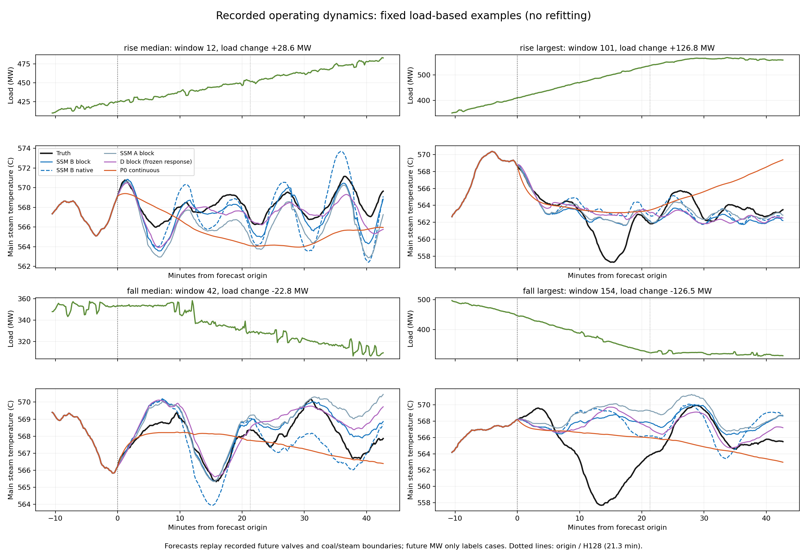
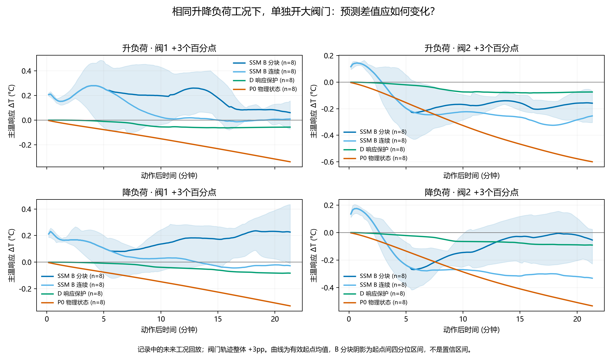

# SSM 已有动态响应；需要修的是动作作用的方向与递推一致性

2026-09-22，依据 Linux 回传 `ddc9c67` 及本地固定权重推演。本次没有训练模型，也没有更换 checkpoint。保留全部基线，主要观察 A（SSM原输入）、B（SSM加历史旁路）、D（SSM背景加冻结R4响应）与 P0（显式热状态）。

目前证据支持：先以 SSM 为主，充分利用它已经学到的动态，再处理具体动作通路。全热状态 P0/P1/P2 此轮没有实现精度不损失；这不等于物理先验整体无用，也不意味着 SSM 的所有动作响应已经可信。

## 续训的结论已经明确

P0 在71轮早停，P1/P2在61轮早停。P1/P2最佳权重未变；P0的short选择从49轮移至67轮，报告集H32/H128/H512 MAE从0.7050/1.2539/2.6757变为0.7145/1.2649/2.7157°C。其余五行不变。继续增加本轮训练预算没有带来突破。

来源：[续训状态](../../results/action_predictor_bench_20260919/physical33_seed11_to90/CONVERGENCE.md)、[续训汇总](../../results/action_predictor_bench_20260919/physical33_seed11_to90/summary.csv)。

## 先看真实升降负荷时能否跟上温度变化

从原CSV提取电负荷，256个报告窗口与原旁路历史逐点吻合、没有缺失。按起点至未来128步（21.3分钟）净负荷变化分组：至少+10MW为升，至多−10MW为降；其余极差至少20MW为变化/反转，剩余为近稳。分组只用于描述结果，没有把未来负荷加进模型。

| 工况 | 窗口数 | B分块 H32 MAE°C | B分块 H128 MAE°C | 60秒温度变化相关 | 变化幅度比 |
|---|---:|---:|---:|---:|---:|
| 升负荷 | 75 | 0.5910 | 1.2708 | 0.7065 | 0.7744 |
| 降负荷 | 62 | 0.5472 | 1.0672 | 0.7821 | 0.8052 |
| 变化/反转 | 20 | 0.4905 | 0.6314 | 0.8261 | 0.8103 |
| 全部 | 256 | 0.5172 | 0.9789 | 0.7394 | 0.7816 |

变化相关看的是“这一分钟升/降了多少”，不是绝对温度是否接近；幅度比为预测变化RMS/真实变化RMS，1表示幅度相当。每窗使用H128内部122个纯未来60秒差值，避免持值预测因跨越历史边界而获得虚假动态分数。P0在全部窗口相关仅0.2722、幅度比0.2419；SSM B连续递推相关0.7049、幅度比0.9763，动作更大但MAE1.2083，逊于分块的0.9789。波动大并不自动等于预测好。

SSM已经能追随不少温度波动，P0则明显过平滑。典型升降负荷曲线按负荷幅度的中位和最大选取，没有按预测误差挑案例。最大的升、降负荷案例中，所有模型都漏掉了一次明显温度深谷，仍有共同缺口。



[可交互曲线](../../results/action_predictor_bench_20260919/ssm_dynamic_20260922/factual_cases.html)可切案例和开关模型；[完整分组表](../../results/action_predictor_bench_20260919/ssm_dynamic_20260922/factual_summary.md)保留17个模型、31种模型/递推组合，包括全部原始基线。

## 再看只改变阀门时，SSM怎样响应

每种起点工况按时间均匀选8个窗口，共32个，不按模型表现筛选。在实际阀门轨迹上加减3个百分点，测试阶跃、连续斜坡、脉冲，以及起点、10.7分钟、21.3分钟动作。每次保持相同历史及外部工况，取“改阀门预测−原阀门预测”。每个动作后观察128步；晚期动作按自身响应期间的实际负荷重新分组。越界计划排除，明细保留。

下表是起点开大3pp、动作后21.3分钟主温响应的8窗口均值：

| SSM B | 升负荷阀1 | 降负荷阀1 | 升负荷阀2 | 降负荷阀2 |
|---|---:|---:|---:|---:|
| 分块递推 | +0.061°C | +0.227°C | −0.158°C | −0.054°C |
| 连续递推 | +0.009°C | −0.027°C | −0.254°C | −0.333°C |

SSM响应并不缺失。阀2后期能出现明显冷却，但最初约一分钟仍先升温；阀1分块模式下开大后平均升温，连续模式才逐渐接近零或转冷。相同权重的两种推演方式也会改变结果。因此，“真实工况下温度能跟随”与“独立调整阀门时方向可靠”确实是两项不同能力。



图中深蓝为B分块、浅蓝为B连续、绿为D、橙为P0；负值是相对原计划冷却。阴影是B分块的窗口间四分位区间，不是置信区间。[交互图](../../results/action_predictor_bench_20260919/ssm_dynamic_20260922/dynamic_response.html)可放大与切换曲线。

全部28种方案中，B分块主温相对“开大冷却/关小升温”参考的反号比例，升/降负荷为46.9%/49.4%；连续为41.0%/36.8%。这些是每个方案内窗口×时间的比例，再对方案等权平均，不是现场干预错误率。P0主温此项为0，但精度与动态幅度不足；D响应较弱且在变化边界下也出现少量反号。所有模型动作前差值为0。具体通道/时间指标见[动作明细](../../results/action_predictor_bench_20260919/ssm_dynamic_20260922/dynamic_response_metrics.json)。

## SSM也在利用变化的煤量、汽量等输入

另外做了四种不训练的配对推演：实际阀门+实际边界、固定阀门+实际边界、实际阀门+固定边界、两者均固定。B分块在升负荷8窗口内，实际阀门计划带来的主温差值绝对值均值约0.591°C，固定阀门下实际边界带来的差值约0.748°C；降负荷分别约0.736/0.396°C。这说明它不仅沿着初始温度惯性走，也会对未来输入轨迹作出响应。它们是模型敏感度，不能当成真实温度变化的因果贡献比例。

重要的输入边界：B只在历史旁路读取MW，未来输入是阀门、煤量、汽量及压力/温度边界。因此现在验证了“回放升降负荷伴随的工况轨迹”，还不能直接把一个“增加50MW”的命令送给它就宣称完成负荷规划模拟。实际部署还需要提供这些边界轨迹的预测或计划。

## 下一步可以更小、更具体

保留B的预测能力，暂不继续扩张整个物理状态网络。优先定位阀1短时升温、阀2初期反向以及跨32步重编码对动作响应的改变：前两者是局部动作敏感性，后者是同一模型的递推一致性。已有D是强响应约束参照，不重复把它当成新方案。后续若做轻量响应正则或局部动作支路，只在这些明确问题上消融，并同时守住升降负荷分组MAE、温度变化幅度和相关性。

本次结果足以支持“SSM是值得保留的动态预测基础”；还不足以支持“SSM可直接作为任意动作规划器”。训练记录里阀门动作也可能是控制器对热扰动的补救，模型把它学成升温线索是一个待验证解释，不能仅由这些曲线确认。

## 复现与结果口径

- 所有模型为seed11既有short checkpoint；本次无训练或报告集选模。
- `load_context.py`从原源文件提取MW/AGC/load_rate，仅MW用于分组；原load_rate是1–6的离散字段，没有当成MW/min。
- `dynamic_factual.py`读取已保存预测，全256窗口重算分组指标。
- `dynamic_response.py`用固定权重float64推演32个起点。全部模型采用同一组计划/边界；B另有固定边界对照。P0的block/native实际相同，只推演一次。
- 差值在同一float64模型内计算。与Linux已保存float32基准的最大绝对预测差：SSM A/B低于0.00028°C，D低于0.00027°C，P0约0.00218°C；不把绝对预测近似一致用作极小动作差值的真实性证明。
- 原报告窗口可能重叠；这是探索性诊断，没有把时间点数量当独立重复样本。

```bash
python -m experiments.action_predictor_bench_20260919.dynamic_factual
python -m experiments.action_predictor_bench_20260919.dynamic_response
```

可直接阅读已保存图表，无需Linux重新训练。原始响应数组、因素分解数组、数据对齐与来源哈希都在[本轮结果目录](../../results/action_predictor_bench_20260919/ssm_dynamic_20260922)。

## 2026-09-22 后续：谷底、保护幅度和双侧规划

已增加同权重 H512 及16/32/64步重编码对照。长程未保护二级阀响应确实大于D，但谷底对推演协议敏感，不能直接用作幅度真值。进一步按五个测点定位保护响应，再设计四阀、AB十温度的消融。

见[完整训练spec](../../docs/plans/2026-09-22-bilateral-response-training-spec.md)、[双侧数据核对](../../docs/plans/2026-09-22-bilateral-data-notes.md)、[谷底统计](../../results/action_predictor_bench_20260919/response_spec_20260922/nadir_summary.md)和[H512固定权重结果](../../results/action_predictor_bench_20260919/response_spec_20260922/horizon_summary.md)。这是新诊断与下一轮规划，不表示双侧模型已训练。
