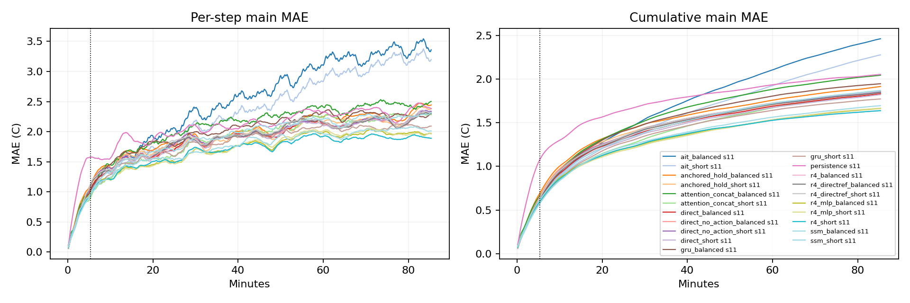

# Quick benchmark results

Block32 reference-refresh and native metrics are separate. Protected arms retain continuous carrier state in block mode; original arms reencode the full model. Missing native entries mean fixed-horizon head, not failure.

| Model | Seed | H32 MAE | Block H128 MAE | Block H512 MAE | Native H512 MAE |
|---|---:|---:|---:|---:|---:|
| ait_balanced | 11 | 0.5911 | 1.3115 | 2.4602 | 36.7485 |
| ait_short | 11 | 0.5906 | 1.2349 | 2.2756 | 39.6461 |
| anchored_hold_balanced | 11 | 0.6921 | 1.3415 | 1.9140 | 1.8710 |
| anchored_hold_short | 11 | 0.6676 | 1.3036 | 1.8565 | 1.8210 |
| attention_concat_balanced | 11 | 0.6611 | 1.3412 | 2.0432 | 4.2787 |
| attention_concat_short | 11 | 0.5880 | 1.1720 | 1.8377 | 4.8998 |
| direct_balanced | 11 | 0.6324 | 1.2525 | 1.8315 | — |
| direct_no_action_balanced | 11 | 0.6500 | 1.2797 | 1.8416 | — |
| direct_no_action_short | 11 | 0.6309 | 1.2750 | 1.8523 | — |
| direct_short | 11 | 0.6148 | 1.2293 | 1.8211 | — |
| gru_balanced | 11 | 0.6265 | 1.3335 | 1.9456 | 3.2423 |
| gru_short | 11 | 0.5770 | 1.2067 | 1.7715 | 3.1595 |
| persistence | 11 | 1.0750 | 1.5879 | 2.0520 | 2.0520 |
| r4_balanced | 11 | 0.5999 | 1.1493 | 1.6374 | 1.7879 |
| r4_directref_balanced | 11 | 0.6292 | 1.2619 | 1.8450 | — |
| r4_directref_short | 11 | 0.6363 | 1.2712 | 1.8616 | — |
| r4_mlp_balanced | 11 | 0.6121 | 1.1447 | 1.6624 | 1.7870 |
| r4_mlp_short | 11 | 0.5984 | 1.1305 | 1.6662 | 1.8156 |
| r4_short | 11 | 0.5999 | 1.1493 | 1.6374 | 1.7879 |
| ssm_balanced | 11 | 0.6144 | 1.2418 | 1.8692 | 1.8277 |
| ssm_short | 11 | 0.5725 | 1.1675 | 1.6945 | 1.8778 |

Read `summary.csv` for costs, tails and dynamic metrics; `seed_summary.json` for optimization-seed spread.
Response strength is not a ranking score. Compare input shapes/doses with `response_metrics.json` and raw `responses.npz`.
Pre-window probes contain 320s model-generated prehistory; early/mid/late events are measured from the scored window.
Recorded-boundary forecasts and held-boundary stress are different information settings. No test/extension data are used.
Anchored native is a hybrid: direct nominal blocks plus uninterrupted R4 action differences. Its block variant resets both components. These modes must not be conflated.
Anchored combination preserves the predictor at the fixed hold-last nominal plan; it is evaluated against actual outcomes under recorded actions, not credited with automatic accuracy preservation.

