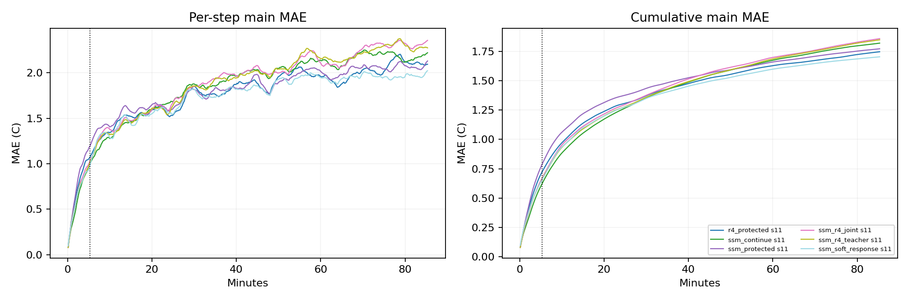

# Quick benchmark results

Block32 reference-refresh and native metrics are separate. Protected arms retain continuous carrier state in block mode; original arms reencode the full model. Missing native entries mean fixed-horizon head, not failure.

| Model | Seed | H32 MAE | Block H128 MAE | Block H512 MAE | Native H512 MAE |
|---|---:|---:|---:|---:|---:|
| r4_protected | 11 | 0.7234 | 1.2614 | 1.7470 | 1.7775 |
| ssm_continue | 11 | 0.6225 | 1.2000 | 1.8205 | 1.8490 |
| ssm_protected | 11 | 0.7878 | 1.3353 | 1.7724 | 1.8600 |
| ssm_r4_joint | 11 | 0.6710 | 1.2416 | 1.8588 | 1.8661 |
| ssm_r4_teacher | 11 | 0.6594 | 1.2256 | 1.8486 | 1.8674 |
| ssm_soft_response | 11 | 0.6544 | 1.2227 | 1.7040 | 1.8454 |

Read `summary.csv` for costs, tails and dynamic metrics; `seed_summary.json` for optimization-seed spread.
Response strength is not a ranking score. Compare input shapes/doses with `response_metrics.json` and raw `responses.npz`.
Pre-window probes contain 320s model-generated prehistory; early/mid/late events are measured from the scored window.
Recorded-boundary forecasts and held-boundary stress are different information settings. No test/extension data are used.
Anchored native is a hybrid: direct nominal blocks plus uninterrupted R4 action differences. Its block variant resets both components. These modes must not be conflated.
Anchored combination preserves the predictor at the fixed hold-last nominal plan; it is evaluated against actual outcomes under recorded actions, not credited with automatic accuracy preservation.

