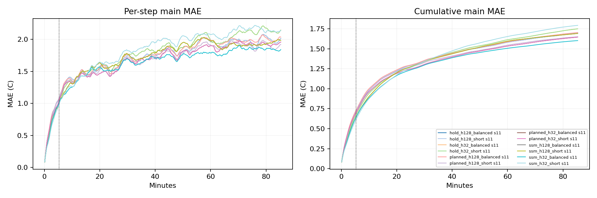

# Quick benchmark results

Block32 reference-refresh and native metrics are separate. Protected arms retain continuous carrier state in block mode; original arms reencode the full model. Missing native entries mean fixed-horizon head, not failure.

| Model | Seed | H32 MAE | Block H128 MAE | Block H512 MAE | Native H512 MAE |
|---|---:|---:|---:|---:|---:|
| hold_h128_balanced | 11 | 0.7051 | 1.2465 | 1.6947 | 1.5912 |
| hold_h128_short | 11 | 0.7051 | 1.2465 | 1.6947 | 1.5912 |
| hold_h32_balanced | 11 | 0.6724 | 1.2253 | 1.7503 | 1.8461 |
| hold_h32_short | 11 | 0.6724 | 1.2253 | 1.7503 | 1.8461 |
| planned_h128_balanced | 11 | 0.7314 | 1.2577 | 1.7039 | 1.6066 |
| planned_h128_short | 11 | 0.7176 | 1.2353 | 1.6508 | 1.5884 |
| planned_h32_balanced | 11 | 0.6984 | 1.2098 | 1.6464 | 1.8900 |
| planned_h32_short | 11 | 0.6984 | 1.2098 | 1.6464 | 1.8900 |
| ssm_h128_balanced | 11 | 0.6435 | 1.2256 | 1.6917 | 1.5528 |
| ssm_h128_short | 11 | 0.6435 | 1.2256 | 1.6917 | 1.5528 |
| ssm_h32_balanced | 11 | 0.6438 | 1.1884 | 1.6029 | 1.7467 |
| ssm_h32_short | 11 | 0.6125 | 1.2007 | 1.7937 | 1.8392 |

Read `summary.csv` for costs, tails and dynamic metrics; `seed_summary.json` for optimization-seed spread.
Response strength is not a ranking score. Compare input shapes/doses with `response_metrics.json` and raw `responses.npz`.
Pre-window probes contain 320s model-generated prehistory; early/mid/late events are measured from the scored window.
Recorded-boundary forecasts and held-boundary stress are different information settings. No test/extension data are used.
Anchored native is a hybrid: direct nominal blocks plus uninterrupted R4 action differences. Its block variant resets both components. These modes must not be conflated.
Anchored combination preserves the predictor at the fixed hold-last nominal plan; it is evaluated against actual outcomes under recorded actions, not credited with automatic accuracy preservation.

