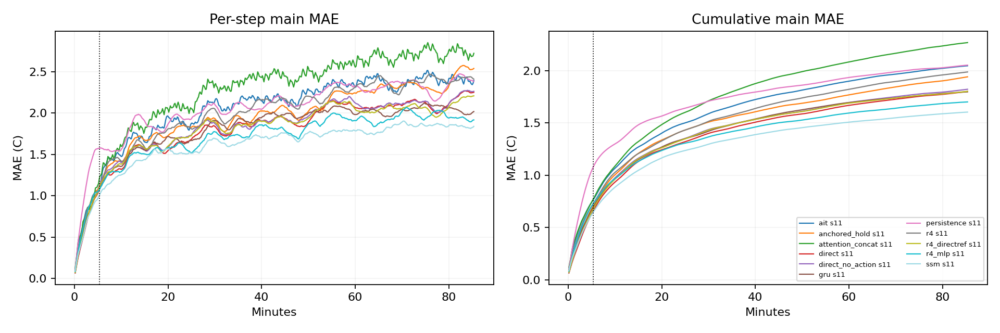

# Quick benchmark results

Block32 reference-refresh and native metrics are separate. Protected arms retain continuous carrier state in block mode; original arms reencode the full model. Missing native entries mean fixed-horizon head, not failure.

| Model | Seed | H32 MAE | Block H128 MAE | Block H512 MAE | Native H512 MAE |
|---|---:|---:|---:|---:|---:|
| ait | 11 | 0.7621 | 1.4350 | 2.0457 | 26.9983 |
| anchored_hold | 11 | 0.7040 | 1.3619 | 1.9401 | 1.8500 |
| attention_concat | 11 | 0.7680 | 1.5202 | 2.2674 | 8.7962 |
| direct | 11 | 0.6539 | 1.2627 | 1.8002 | — |
| direct_no_action | 11 | 0.6722 | 1.2894 | 1.8212 | — |
| gru | 11 | 0.6899 | 1.2961 | 1.7959 | 2.4223 |
| persistence | 11 | 1.0750 | 1.5879 | 2.0520 | 2.0520 |
| r4 | 11 | 0.7265 | 1.3586 | 1.9866 | 1.8367 |
| r4_directref | 11 | 0.6734 | 1.2848 | 1.8013 | — |
| r4_mlp | 11 | 0.7234 | 1.2575 | 1.7001 | 1.7775 |
| ssm | 11 | 0.6438 | 1.1884 | 1.6029 | 1.7467 |

Read `summary.csv` for costs, tails and dynamic metrics; `seed_summary.json` for optimization-seed spread.
Response strength is not a ranking score. Compare input shapes/doses with `response_metrics.json` and raw `responses.npz`.
Pre-window probes contain 320s model-generated prehistory; early/mid/late events are measured from the scored window.
Recorded-boundary forecasts and held-boundary stress are different information settings. No test/extension data are used.
Anchored native is a hybrid: direct nominal blocks plus uninterrupted R4 action differences. Its block variant resets both components. These modes must not be conflated.
Anchored combination preserves the predictor at the fixed hold-last nominal plan; it is evaluated against actual outcomes under recorded actions, not credited with automatic accuracy preservation.

