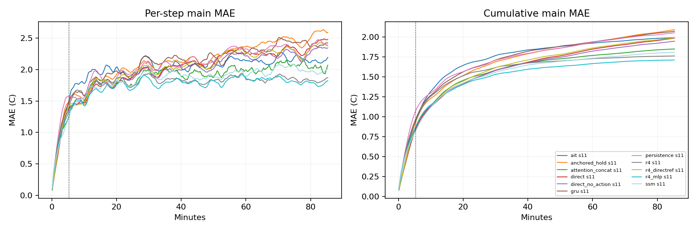

# Quick benchmark results

Common block32 protocol; native metrics are separate. Missing native entries mean fixed-horizon head, not failure.

| Model | Seed | H32 MAE | Block H128 MAE | Block H512 MAE | Native H512 MAE |
|---|---:|---:|---:|---:|---:|
| ait | 11 | 0.9439 | 1.6658 | 1.9917 | 14.3070 |
| anchored_hold | 11 | 0.9330 | 1.5445 | 2.0916 | 2.0198 |
| attention_concat | 11 | 0.8606 | 1.4781 | 1.8497 | 3.6744 |
| direct | 11 | 0.8398 | 1.4401 | 1.9864 | — |
| direct_no_action | 11 | 0.8577 | 1.4456 | 1.9475 | — |
| gru | 11 | 0.9697 | 1.5860 | 2.0702 | 2.0519 |
| persistence | 11 | 1.0750 | 1.5879 | 2.0520 | 2.0520 |
| r4 | 11 | 0.9464 | 1.5358 | 1.7625 | 1.9454 |
| r4_directref | 11 | 0.8773 | 1.4726 | 1.9909 | — |
| r4_mlp | 11 | 0.8750 | 1.4281 | 1.7120 | 1.9097 |
| ssm | 11 | 0.8232 | 1.4468 | 1.8091 | 1.8746 |

Read `summary.csv` for costs, tails and dynamic metrics; `seed_summary.json` for optimization-seed spread.
Response strength is not a ranking score. Compare input shapes/doses with `response_metrics.json` and raw `responses.npz`.
Pre-window probes contain 320s model-generated prehistory; early/mid/late events are measured from the scored window.
Recorded-boundary forecasts and held-boundary stress are different information settings. No test/extension data are used.
Anchored native is a hybrid: direct nominal blocks plus uninterrupted R4 action differences. Its block variant resets both components. These modes must not be conflated.
Anchored combination preserves the predictor at the fixed hold-last nominal plan; it is evaluated against actual outcomes under recorded actions, not credited with automatic accuracy preservation.

